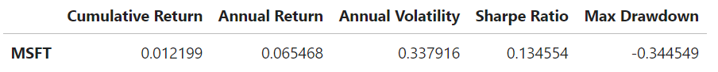

# The Convergence of Models
### Continuous and Binary Predictions in Stock Trading

Aung Si<br>
August 30<sup>th</sup>, 2023<br>
<sub>STATUS: <i>COMPLETE</i></sub>
---

## Contents
- [Introduction](#introduction)
- [Methodology](#methodology)
    - [A Note on Methodological Nuances](#a-note-on-methodological-nuances)
    - [Breakdown](#breakdown)
- [Minimizing False Positives: Precision](#minimizing-false-positives-precision)
- [The Data](#the-data)
- [Assessing MSFT](#assessing-msft)
- [Model Building and Iteration](#model-building-and-iteration)
- [Model Evaluation on Unseen Data](#model-evaluation-on-unseen-data)
- [Backtesting a Long-Only Strategy](#backtesting-a-long-only-strategy)
    - [Results](#results)
    - [The Limitations of Machine Learning Limitations and Utility in the Stock Market](#the-limitations-of-machine-learning-limitations-and-utility-in-the-stock-market)
- [Limitations of this Study](#limitations-of-this-study)
- [Future Work](#future-work)
- [Repository Structure](#repository-structure)

---

## Introduction
Predicting stock market behavior is a labyrinth often yielding inconsistent outcomes. This study sidesteps the traditional approach of stock price forecasting, opting instead to focus on daily stock returns—specifically for Microsoft (MSFT) from January 2022 to June 2023. Employing linear and logistic regression models, we assess their performance using metrics like RMSE and precision. However, the study serves a dual purpose: beyond merely identifying robust models, it aims to illuminate the often-overlooked discrepancy between stellar model performance in controlled settings and its actual utility in the volatile, self-correcting financial markets. The goal isn't to unearth a foolproof strategy for outsized gains but to delve into the complexities of model selection, tuning, and their real-world applicability.

## Methodology

### A Note On Methodological Nuances
This study deliberately diverges from the standard practice of regressing stock values, opting instead to forecast directional stock return movement, denoted as -1 and 1 for downward and upward trends respectively. This pivot carries significant ramifications for both real-world utility and evaluative metrics. In the real trading environment, precise directional movement prediction often holds more actionable value than exact future stock prices. This aligns particularly well with long-only trading strategies, where the focus is on identifying stocks poised for upward movement.

Evaluation metrics undergo a dual-phase transition. Initially, RMSE serves as the yardstick for selecting the optimal regressor, ensuring the chosen model minimizes the square errors of continuous return predictions. However, the model's output is then binarized to fit into a classification schema, at which point the evaluative spotlight shifts to precision. This metric is paramount in a long-only strategy, as it adeptly quantifies the model's ability to minimize false positives, a crucial factor in maximizing profitability. By employing RMSE in the initial phase and pivoting to precision for final assessment, the study harmonizes the evaluation process, making it possible to compare 'apples to apples' when transitioning from regression to classification models.

### Breakdown

1. **Data Preparation**
    - The inputs—Open, High, Low, Volume, and Inflation—are transformed into percentage changes to improve linearity, followed by standard scaling for model optimization. These are used to predict our target, which is the signage of the daily returns of Microsoft (MSFT).<br>

2. **Determining the Best Regressor** (each evaluated on RMSE)
    - **Linear Regression**: Serves as the baseline.
    - **Decision Tree Regression**: A non-linear model.
    - **Tuning Decision Tree**: Hyperparameter-optimized using `GridSearchCV`.
    - **Random Forest Regression**: An ensemble approach.
    - **Tuning Random Forest**: Further refined through hyperparameter tuning.
    - **Classification Conversion**: The best-performing regressor's output is binarized to indicate directionality, making precision and accuracy the pivotal metrics for this phase.<br>

3. **Logistic Regression Modeling**
    - Directly predicts binary outcomes, with performance gauged through precision.
    - **Hyperparameter Tuning**: Grid search optimizes the logistic model, focusing on improving precision.<br>

4. **Real-world Validation**
    - Both models undergo back-testing in a long-only trading strategy, providing a real-world performance benchmark.

## The Data

The dataset scrutinized comprises daily trading variables for MSFT, spanning from January 1, 2022, to June 1, 2023.* We focus on salient trading indicators like volume, open, high, and low prices, augmented by the inflation rate as an external macroeconomic variable. These attributes are converted to percentage changes, a transformation aimed at enhancing their linearity and thereby optimizing their compatibility with linear models. Post-transformation, the features undergo standard scaling to normalize their ranges and boost model performance. This forms the bedrock for the ensuing model selection and performance evaluations.

**The data is retrieved using `yfinance` and can be found [here](data/MSFT-20220101-20230601.csv).*

## Minimizing False Positives: Precision

In a long-only trading strategy, where the objective is to capitalize on upward market movements, the cost of false positives—incorrectly predicting a stock will rise when it actually declines—can be substantial. Precision emerges as a vital performance metric in this context. It quantifies the model's ability to correctly identify true positives while minimizing false positives, thus serving as a gauge of the model's reliability in maximizing profitability.

By focusing on precision as the evaluative metric, the study aligns the model assessment process with the real-world trading objectives. This is particularly crucial when the model's recommendations directly influence trading decisions, where a high rate of false positives can erode the investment capital rapidly. In sum, the choice of precision as the primary metric offers a targeted approach to model evaluation, one that is particularly aligned with the risk and reward profile of a long-only trading strategy.

## Assessing MSFT


In assessing Microsoft's (MSFT) financial performance, key metrics reveal a nuanced picture:



The cumulative return of 1.22% indicates modest capital appreciation, while an annualized return of 6.55% offers moderate, yet consistent gains. However, these rewards come at the cost of elevated risk, as reflected in the annualized volatility of 33.79% and a maximum drawdown of -34.45%. The Sharpe ratio of 0.13 further underscores that these returns are attained by shouldering a considerable amount of risk. It's noteworthy that these statistics come on the heels of a turbulent 2022, marked by record-high inflation rates that led to a broad stock market downturn. While tech stocks, including MSFT, have generally shown signs of recovery this year, the outlook remains uncertain. Given this backdrop, MSFT appears to be an investment suited for those with higher risk tolerance, seeking moderate returns in a market still finding its footing post-crash.

The nature of inflation in the past year is shown below:


## Model Building and Iteration
The objective was two-fold: first, to identify the best-performing regressor based on RMSE, and then to turn its predictions into binary form for comparison with classifiers. Second, to choose the best-performing classifier, also based on cross-validation scores. 

All regressors were evaluated on RMSE using 5-fold cross-validation. Among them, Linear Regression secured the lowest test RMSE of 0.014, and was therefore selected. The predictions from this model were then converted to binary form for further analysis:


The two classifiers, Logistic Regression and a Hyperparameter-Optimized Logistic Regression, were evaluated on precision, also using 5-fold cross-validation. Between them, the optimized model yielded the higher precision score within the cross-validation, and was therefore selected:


## Model Evaluation on Unseen Data

When tested on unseen data, the binary predictions from the Linear Regression model yielded a precision of 72.90% and an accuracy 76.00%. The Tuned Logistic Regression model, however, showed superior performance, achieving a precision of 85.11% and an accuracy of 82.00%. This indicates that Tuned Logistic Regression is more effective in minimizing false positives, making it a preferred choice in a long-only trading strategy.

## Backtesting a Long-Only Strategy
The final litmus test of our models encompasses backtesting to assess the real-world applicability of the predictive models. The code starts by creating a DataFrame called backtest that contains the actual test values, then adds two new columns to store the binary trading signals generated by the Linear Regression and Tuned Logistic Regression models. Signals predicting a downward trend (-1) are replaced with NaN to align with the long-only strategy, which focuses solely on positive market movements.

To simulate real-world trading latency, the signals are shifted down by one row. The strategy returns are then calculated by multiplying the shifted signals with the actual stock returns. This process generates two sets of strategy returns, one for each model. The initial return value at the start index is set to zero for both strategies and for the stock itself, serving as a baseline for comparison:

```python
import pandas as pd

def growth(series):
    return (1 + series).cumprod() - 1

backtest = pd.DataFrame(y_test)
start_idx = backtest.index.min()

backtest['linreg_signal'] = y_pred_linreg_binary
backtest['tuned_logreg_signal'] = y_pred_logreg

for signal in ['linreg', 'tuned_logreg']:
    signal_name = f'{signal}_signal'
    backtest[signal_name] = backtest[signal_name].replace(-1, np.nan)
    backtest[signal_name] = backtest[signal_name].shift()
    strat_returns = backtest[stock] * backtest[signal_name]
    backtest[f'{signal}_returns'] = strat_returns
    backtest[f'{signal}_returns'].loc[start_idx] = 0
    backtest[f'{signal}_growth'] = growth(backtest[f'{signal}_returns'])

backtest[stock].loc[start_idx] = 0
backtest[f'{stock}_growth'] = growth(backtest[stock])
```

Subsequently, we use the strategy returns to calculate the cumulative portfolio growth over time. This offers a realistic gauge of how well each trading strategy would have performed in comparison to simply holding the stock. The results form the empirical backbone of the study, validating the efficacy of the chosen models in a practical trading context.

### Results

The backtesting results present an intriguing contrast to the earlier model evaluations:


Despite Tuned Logistic Regression showing superior precision in prior tests, it underperformed in backtesting with a cumulative return of 10.43% and an annualized return of 55.27%. Linear Regression, less precise but more robust, yielded a cumulative return of 16.73% and an annualized return of 68.06%. Simply holding MSFT outperformed both with a cumulative return of 46.68% and an annualized return of 100.62%.

Although Tuned Logistic Regression displayed lower risk, evident by its annualized volatility of 25.31%, it didn't translate into superior returns. All strategies registered positive Sharpe Ratios, but the higher precision of Tuned Logistic Regression didn't yield a better risk-adjusted return.

The likely cause for this performance gap could be the one-day lag introduced by the `.shift()` function. While the model might have been more precise, the lag could have misaligned the timing, leading to suboptimal trading signals.

### The Limitations of Machine Learning Limitations and Utility in the Stock Market
The disparate results between model evaluation and backtesting amplify the unique challenges posed by the stock market, a self-correcting ecosystem. Unlike many other domains where machine learning excels, the stock market is not a static environment. It dynamically adjusts to new information, including trading strategies that prove successful, thereby diminishing their future effectiveness. The one-day lag from the `.shift()` method illustrates this point, revealing how even minor temporal misalignments can significantly impair a model's real-world utility.

In addition to self-correction, the market is influenced by a multitude of factors—ranging from global events to investor psychology—that are often outside the purview of historical data-based models. This complexity makes it difficult for any machine learning model to capture the full spectrum of market behavior, risking overfit to past conditions and limited adaptability to new scenarios.

Despite these constraints, machine learning's value in stock trading shouldn't be dismissed. Its strength lies in sifting through vast datasets to identify subtle patterns or correlations, providing traders with insights that might otherwise be overlooked. Used wisely, machine learning can automate certain trading processes, optimize risk management, and unearth novel trading opportunities (<i>see my [replication](https://github.com/aungsias/Eigen/tree/main/Replications/1.%20LSTM%20for%20Portfolio%20Optimization) on an LSTM model on portfolio optimization</i>). 

While machine learning may not serve as a standalone solution for market prediction, machine learning remains a potent adjunct tool for traders, as long as its limitations within this self-correcting, ever-evolving marketplace are fully acknowledged.

## Limitations of this Study
This study, while rigorous in its methodology, is not without limitations. Chief among them is the use of daily data, which introduces the problem of a one-day lag when applying the `.shift()` function to simulate real-world trading latency. This lag likely distorted the efficacy of the trading signals generated by the models, leading to underperformance in the backtesting phase. Additionally, the study focused solely on Microsoft (MSFT), limiting the generalizability of the findings to other stocks or market segments. The models were also not tested during varying market conditions, such as bear markets or periods of high volatility, which would offer a more comprehensive understanding of their robustness.

## Future Work
Given the limitations identified, several avenues for future work emerge. First, incorporating intraday data could mitigate the issue of the one-day lag, offering a more immediate application of trading signals. Second, expanding the scope to include a diverse set of stocks and market conditions would provide a more rounded evaluation of the model's capabilities. It would also be beneficial to explore hybrid models that combine both regression and classification techniques or incorporate alternative machine learning methods like neural networks for comparison. Finally, integrating real-time market data and indicators, such as news sentiment or macroeconomic variables, could potentially enrich the models, making them more adaptive to the complex, self-correcting nature of financial markets.

## Repository Structure
```
.
|-- data/
|-- img/
|-- index.ipynb
|-- README.md
```