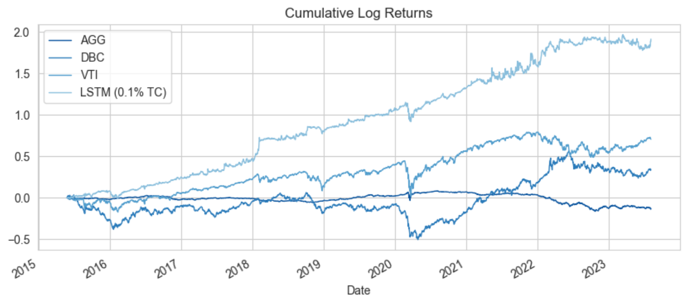
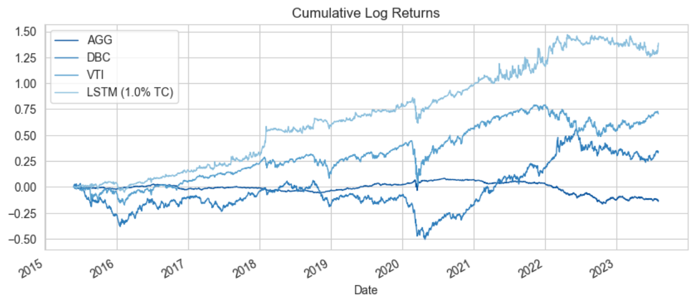

# Long Short-Term Memory for Portfolio Optimization

---

## Contents

- [Introduction](#introduction)
- [Problem Statement](#problem-statement)
- [Dataset](#dataset)
- [Model Architecture](#model-architecture)
- [Training Process](#training-process)
- [Prediction and Rebalancing](#prediction-and-rebalancing)
- [Backtesting and Results](#backtesting-and-results)
- [Conclusion](#conclusion)

---

## Introduction
This project is inspired by the research paper "Deep Learning for Portfolio Optimization" by Zihao Zhang, Stefan Zohren, and Stephen Roberts from the Oxford-Man Institute of Quantitative Finance, University of Oxford. The paper presents an unorthodox approach to portfolio optimization that leverages deep learning models to directly optimize the portfolio Sharpe ratio.

### Key Points in the Study
- **Circumventing Forecasting Requirements**: Traditional portfolio optimization often relies on forecasting expected returns. This study, however, introduces a framework that eliminates the need for such forecasting. It directly optimizes portfolio weights by updating model parameters, providing a novel means for asset allocation.

- **Trading Exchange-Traded Funds (ETFs)**: Instead of selecting individual assets, the paper focuses on trading ETFs of market indices to form a portfolio. This approach simplifies the asset selection process by way of utilising market indices as proxies for larger universes of asset classes.

- **Performance Evaluation**: The paper extensively compares the proposed method with various algorithms. The results demonstrate superior performance over the testing period, from 2011 to the end of April 2020. This includes periods of financial instability, highlighting the model's robustness.

- **Sensitivity Analysis**: An insightful sensitivity analysis is conducted to understand the relevance of input features, shedding light on the critical factors influencing the model's success.

This project aims to emulate the study's methodology and apply it to a new dataset, exploring the practical implementation of deep learning in the context of portfolio optimization. The motivation behind this emulation is to provide a readily implementable public codebase for usage, scrutiny, and education. The [accompanying reference paper](<./[REFERENCE PAPER] Deep Learning for Portoflio Optimization, University of Oxford.pdf>) provides a comprehensive understanding of the underlying theory and techniques.

### Disclaimer
Please note that while this project seeks to faithfully emulate the methodology described in the accompanying reference paper, certain complexities and nuances may have been simplified or omitted for the sake of accessibility and clarity. This implementation should be seen as an educational resource and a starting point for further exploration rather than a complete replication of the original study's full sophistication. Users are encouraged to refer to the original paper for a comprehensive understanding of the underlying theory and techniques.

---

## Problem Statement

Predict optimal weights for assets in a portfolio given historical price and daily return data so as to maximize the portfolio's Sharpe Ratio.

---

## Implementation

### Data

I use the same 

### Model Architecture

The model proposed in the paper consists of three main components: the input layer, the neural layer, and the output layer:

- **Input Layer**: The model takes in information from multiple assets $A_{i}$ to form a portfolio. Each asset's features, such as past prices and returns, are concatenated, resulting in an input dimension of $(k, 2 \times n)$, where $k$ is the lookback window and $n$ is the number of assets.

- **Neural Layer**: Various deep learning architectures, including fully connected neural networks (FCN), convolutional neural networks (CNN), and Long Short-Term Memory networks (LSTM), were tested. LSTM demonstrated the best performance for daily financial data due to its ability to filter and summarize information efficiently, resulting in better generalization. FCNs were prone to overfitting, while CNNs sometimes led to underfitting.

- **Output Layer**: To build a long-only portfolio, a softmax activation function is used, ensuring the portfolio weights are positive and sum to one. The output nodes correspond to the number of assets, and the portfolio weights are multiplied with the assets' returns to calculate the realized portfolio returns. The Sharpe ratio is then derived, and gradient ascent is applied to update the model parameters

For simplicity, I've implemented the model as such:

```python
import torch
from torch.nn import LSTM, Linear, Module

class PortOptNN(Module):
    def __init__(self, input_dim, hidden_dim, output_dim):
        super(PortOptNN, self).__init__()
        self.lstm = LSTM(input_dim, hidden_dim, batch_first=True)
        self.fc = Linear(hidden_dim, output_dim, bias=True)
        self.softmax = Softmax(dim=-1)

    def forward(self, x):
        lstm_out, _ = self.lstm(x)
        lstm_out_last = lstm_out[:, -1, :]
        fc_out = self.fc(lstm_out_last)
        output = self.softmax(fc_out)
        return output
```

The key difference is the focus on the LSTM architecture. While the paper experimented with various deep learning models (FCNs and CNNs), I specifically test an LSTM as the paper found it to have delivered the best performance in terms of 1) finding weights that maximize the Sharpe Ratio 2) resilience in the face of market turmoil, and 3) providing the highest cumulative return net fees.

### Objective Function
The core objective of the model is to maximize the Sharpe ratio, a widely recognized measure of risk-adjusted returns. The Sharpe ratio quantifies the return per unit of risk in a portfolio and in effect measures the ability of the portfolio to generate returns considering its underlying risk. The original paper circumvents the forecasting of future returns and maximizes the following function directly for each trading period:

$$L_{T} = \frac{E(R_{p,t})}{\sqrt{E(R^2_{p,t}) - (E(R_{p,t}))^2}}$$
$$E(R_{p,t}) = \frac{1}{T}\sum^T_{t=1}R_{p,t}$$

where $R_{p,t}$ is realized portfolio return over n assets at time $t$:

```python
def objective(outputs, targets):
    portfolio_returns = (outputs * targets).sum(dim=1)
    mean_portfolio_return = portfolio_returns.mean()
    volatility = torch.std(portfolio_returns)
    sharpe_ratio = mean_portfolio_return / volatility
    return sharpe_ratio
```

### Performance


