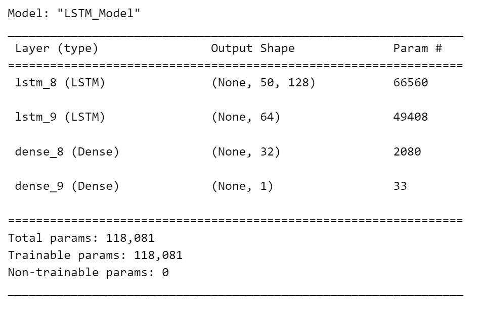
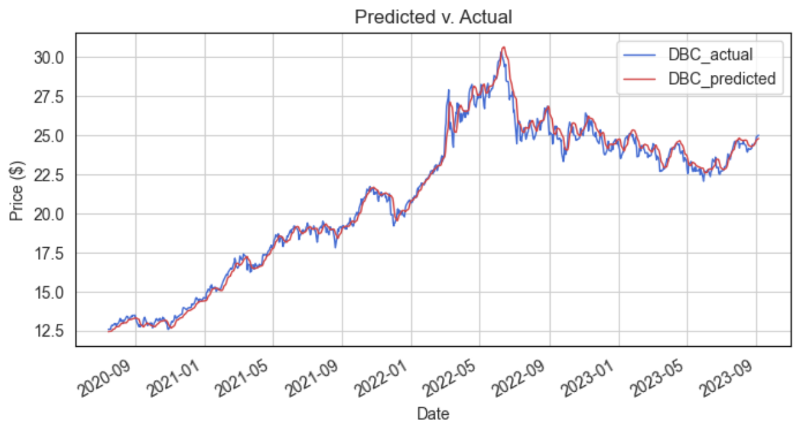
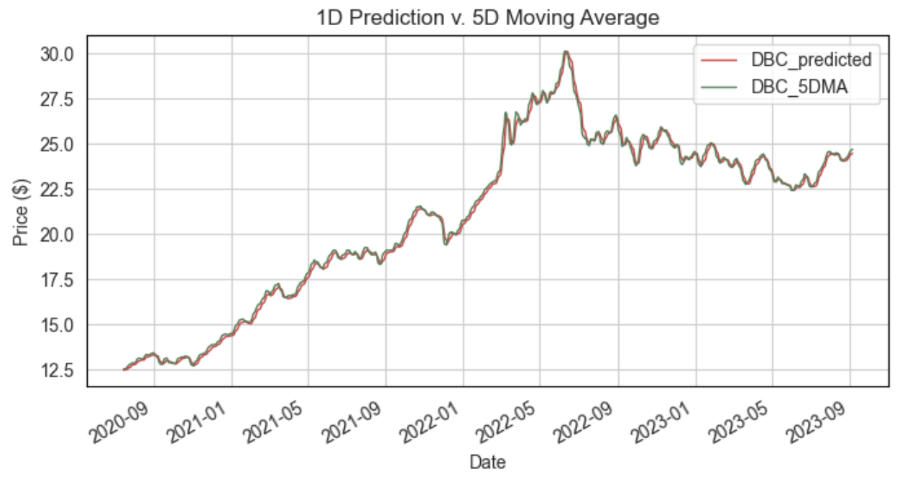
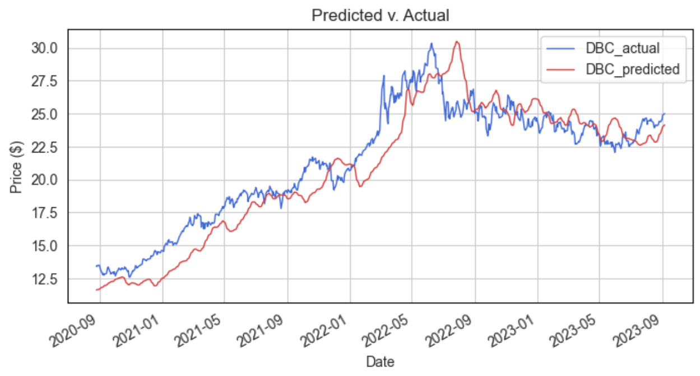

# The Conditional Clairvoyance of LSTMs in Stock Market Forecasting
### 

Aung Si<br>
September 7<sup>th</sup>, 2023<br>
<sub>STATUS: <i>COMPLETE</i></sub>
---

## Contents
- [Introduction](#introduction)
- [The Allure and Illusion of One-Day-Ahead Predictions](#the-allure-and-illusion-of-one-day-ahead-predictions)
    - [The Overarching Narrative](#the-overarching-narrative)
    - [Breaking the Illusion](#breaking-the-illusion)
        - [The Sophisticated Moving Average](#the-sophisticated-moving-average)
        - [Misleading Metrics](#misleading-metrics)
- [The Conspicuous Absence of Multi-Day Forecasts](#the-conspicuous-absence-of-multi-day-forecasts)
    - [The Unspoken Caveats](#the-unspoken-caveats)
    - [The Underlying Challenges](#the-underlying-challenges)
- [Conclusion: A Balanced View](#conclusion-a-balanced-view)
- [Repository Structure](#repository-structure)

---

## Introduction

Long Short-Term Memory (LSTM) networks, a type of recurrent neural network architecture, have been the cynosure of many machine learning tutorials focusing on time-series forecasting, particularly in the realm of financial markets. These tutorials frequently follow a predictable script: introduce LSTMs, build a simple model, predict stock prices one day ahead, and conclude with awe-inspiring graphs showing the model's predictions nearly superimposed on the actual prices. But here's the crux—the narrative often ends abruptly at this juncture, leaving the reader with an inflated, yet fundamentally incomplete, understanding of what LSTMs can accomplish. This article aims to deconstruct this incomplete narrative and present a more balanced view of LSTMs' capabilities and limitations in stock market forecasting.

I use the adjusted closing prices of the Invesco DB Commodity Index Tracking Fund (DBC) from January 3<sup>rd</sup>, 2007 to September 5<sup>th</sup> 2023 for the article, the CSV file for which can be found [here](data/DBC-20070103-20230905.csv). The architecture for the LSTM model used in this article is as below:

<div style="text-align:center;">
  
</div>

## The Allure and Illusion of One-Day-Ahead Predictions

### The Overarching Narrative
The typical LSTM tutorial with respect to the markets leverages the architecture's capacity to capture sequential dependencies to forecast stock prices. With an ostensibly straightforward setup and a few lines of code, these tutorials purport to unveil a tool of almost mystical predictive power. A graph is usually presented, showing the model's one-day-ahead prediction closely tracing the real stock prices, looking something like: 

<div style="text-align:center;">
  
</div>

With an $R^2$ of 0.98759 and an MAE of 0.37995, the message is seemingly clear: LSTMs are potent tools capable of predicting financial markets.

###  Breaking the Illusion
#### The Sophisticated Moving Average
Let's demystify this: when an LSTM model is trained to predict stock prices one day ahead, what it's fundamentally doing is producing a sophisticated moving average of the existing time series. The model, in essence, is 'rubbernecking'; it's largely looking at what has just happened to make a highly localized prediction about what will happen next. The so-called 'prediction' is substantially an echo of the recent past. Compare the prediction to an actual 5-day moving average and we have something that looks like this:

<div style="text-align:center;">
  
</div>

Evidently, the two are almost perfectly superimposed.

#### Misleading Metrics
Moreover, performance metrics like $R^2$ and Mean Absolute Error are can be very misleading. While these metrics are valid measures of model performance, A high $R^2$ and a low MAE in the context of a one-day-ahead prediction are not unequivocal indicators of the model's forecasting power. They only suggest that the model is adept at short-term, lagged predictions—a far cry from genuine, actionable financial forecasting.

## The Conspicuous Absence of Multi-Day Forecasts
### The Unspoken Caveats
The glaring omission in many tutorials is the absence of extended, multi-day forecasts. Our experiments reveal a sobering reason for this: the model's performance as per the $R^2$ and MAE remained relatively stable, while the moving average problem remains. For example, in a 30-day-ahead forecast, though it dropped by a small margin, the $R^2$ value still remains high (0.83644) and the MAE low (1.43676), and the predictions in this case show an even more lagged version of the original price series:

<div style="text-align:center;">
  
</div>

### The Underlying Challenges
Several factors contribute to the model's diminished utility in multi-day forecasts:

- **Non-Stationarity**: Financial markets are dynamic, subject to a myriad of influences, ranging from geopolitical events to market sentiment, none of which an LSTM model is inherently designed to capture.

- **Overfitting Risks**: LSTMs, when faced with the intricate patterns and noise in stock market data, risk fitting the training data too closely, thereby failing to generalize on new, unseen data.

- **Feedback Complexity**: The feedback loops in financial markets make them complex adaptive systems. An LSTM model doesn't account for the impact of its predictions on the market, making its so-called 'forecasts' contextually inadequate.

You might even come across suggestions advocating the use of LSTM predictions in crossover trading strategies. On the surface, this seems like a novel application, offering a sophisticated approach to trading. However, employing LSTM-based crossover strategies wouldn't offer any more utility than a conventional moving average crossover strategy.

Both methods are, in essence, reactive rather than predictive. They respond to price movements that have already occurred, making them fundamentally lagging indicators. Given that LSTM-based forecasts resemble sophisticated moving averages, their use in crossover strategies would not be as much an innovative leap forward as it would be a reiteration of existing techniques.

## Conclusion: A Balanced View
The allure of using LSTMs for stock market prediction is easy to understand, but the practical applications are far from straightforward. While short-term, one-day-ahead predictions yield numerically impressive performance metrics, they are fundamentally limited in scope and utility. Multi-day forecasts bring the model's limitations into sharp relief, underlining its inability to capture the multifaceted dynamics of financial markets.

So, when you encounter yet another article proclaiming the predictive wizardry of LSTMs, bear in mind that in the intricate and unpredictable world of financial markets, predictive precision is not just elusive but inherently conditional.

All that said, this article is not an indictment of LSTMs; they are versatile and have demonstrable utility in various domains. The aim is to foster a nuanced understanding of their application in financial forecasting. Keep an eye out for a future article where I'll showcase an example of how LSTMs can indeed be used effectively in a specific context.

Feel free to explore the code used in this article [here](index.ipynb).

## Repository Structure
```
.
|-- data/
|-- img/
|-- index.ipynb
|-- README.md
```
