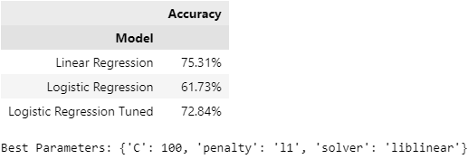

## Contents
- [Introduction](#introduction)
    - [Addressing the Elephant in the Room](#addressing-the-elephant-in-the-room)
    - [Linear and Logistic Regression in Brief](#linear-and-logistic-regression-in-brief)
        - [Linear Regression](#linear-regression)
        - [Logistic Regression](#logistic-regression)
- [Methodology](#methodology)
- [Implementation](#implementation)
    - [Price Retrieval and Data Preprocessing](#price-retrieval-and-data-preprocessing)
    - [Handling Zero Returns and Preparing for Binary Classification](#handling-zero-returns-and-preparing-for-binary-classification)
    - [Feature Selection and Train-Test Split](#feature-selection-and-train-test-split)
    - [Model Training](#model-training)
    - [Predicting Movement and Assessing Accuracy of Predictions](#predicting-movement-and-assessing-accuracy-of-predictions)

## Introduction
The prediction of stock price movements remains a central challenge and a point of fascination in various disciplines, from finance and economics to machine learning. Complex methodologies, including deep learning and sophisticated time-series analyses, have advanced the field, often dominating the conversation. However, in the midst of this complexity, there is still a strong case for revisiting simpler models.

In this study, we turn our attention to linear and logistic regression models to predict the directional movement of Apple Inc.'s stock price. Though these models may seem almost rudimentary compared to the multifaceted techniques now available, they offer valuable insights. Simplicity can provide clarity, interpretability, and a connection to foundational principles that might be lost in more intricate approaches.

The goal here is not to overshadow the advanced models but to understand the basic ones, recognize their limitations, and appreciate their role in the broader context of predictive analytics. By focusing on linear and logistic regressions, this exploration serves as a reminder that sometimes, the most profound insights can be derived from the basics. It's an academic endeavor that reinforces the importance of foundational learning and the continuous pursuit of understanding, even in a field that is ever-evolving and increasingly complex.

### Addressing the Elephant in the Room

In financial time series data, autocorrelation can complicate modeling and forecasting. This statistical property, where a stock's price today might be closely related to its price in recent days or weeks, undermines the assumption that observations are independent. To address this challenge, our analysis will utilize a shorter timeframe for both training and testing. By limiting the period of analysis and employing logarithmic returns, we aim to diminish the effect of autocorrelation, thus creating a more reliable model. This decision enables a focus on more immediate relationships in the data, without the potential distortion caused by lingering long-term dependencies.

### Linear and Logistic Regression in Brief
#### Linear Regression
Linear regression typically outputs continuous values. However, for our specific purpose of predicting the directional movement of stock prices (up or down), we need to convert these continuous predictions into binary form. We do this by applying a sign function to the continuous predictions. A positive prediction is translated into +1, representing an upward movement, while a negative prediction is translated into -1, representing a downward movement. This conversion allows us to compare the performance of the linear regression model directly with the logistic regression model, which inherently predicts binary outcomes. Linear regression can be generalized as such:

$$y=\beta{X} + \alpha$$

where $y$ is the predicted value, $\beta$ is the coefficient for the independent variable, and $\alpha$ is the y-intercept.

#### Logistic Regression
Logistic regression is designed to predict binary outcomes and outputs probabilities. In the context of our study, it is used to predict whether the stock price will move up or down. The model classifies the probabilities into two classes, typically using 0.5 as a threshold. A probability greater than 0.5 translates into a prediction of upward movement, while a probability less than or equal to 0.5 translates into a prediction of downward movement. Logistic regression can be generalized as such:

$$p(y=1) = \frac{1}{1 + e^{-(\beta{X} + \alpha)}}$$

where $p(y=1)$ is the probability of that the dependent variable $y$ is 1 (e.g. the stock price goes up), $\beta$ is the coefficient for the independent variable $X$, $\alpha$ is the bias term, and $e$ is the base of the natural logarithm.

## Methodology

The methodology of this exploration is broken down as follows:

## Implementation

### Price Retrieval and Data Preprocessing

Prices for AAPL, VTI, DBC, AGG, and ^VIX were retrieved using the `yfinance` library and can be accessed [here](data/AAPL-VTI-DBC-VIX-AGG-prices-20220101-20230814.csv).

```python
import pandas as pd
import numpy as np
from sklearn.model_selection import train_test_split
from sklearn.linear_model import LinearRegression, LogisticRegression

# Defining start and end dates.
start = '2022-01-01'
end = '2023-08-14'

# Reading in the prices
prices = pd.read_csv('data/AAPL-VTI-DBC-VIX-AGG-prices-20220101-20230814.csv', index_col=0, parse_dates=True)
data = np.log(prices).diff()[1:]
data.head()
```


### Handling Zero Returns and Preparing for Binary Classification
In financial time series data, particularly when dealing with returns, it's possible to encounter zero values. These zeros can create complications when trying to predict binary outcomes, such as upward or downward stock price movements, as they introduce a third class that is neither upward nor downward.

To ensure that our logistic regression model has only two classes to predict, we need to address these zero returns in our dataset. To address this, I replaced zeros with the mean of the non-zero values up to that point (i.e., the rolling mean). This technique preserves the overall distribution of the data while eliminating the third class:

```python
def replace_zeros_with_rolling_mean(series):
    non_zero_values = series.replace(0, np.nan)
    rolling_mean = non_zero_values.expanding().mean()
    for idx, value in series.items():
        if value == 0:
            series.at[idx] = rolling_mean.at[idx]
    return series

data = data.apply(replace_zeros_with_rolling_mean)
```

### Feature Selection and Train-Test Split

```python
from sklearn.model_selection import train_test_split
X = data[indices]
y_linear = data[stock].squeeze()

X_train, X_test, y_train_linear, y_test_linear = train_test_split(X, y_linear, shuffle=False, test_size=.2, random_state=42)
y_train_logistic, y_test_logistic = np.sign(y_train_linear), np.sign(y_test_linear)
```

### Model Training

```python
from sklearn.linear_model import LinearRegression, LogisticRegression

linear_regression = LinearRegression()
logistic_regression = LogisticRegression(random_state=42) # Set random state for reproducability.

linear_regression.fit(X_train, y_train_linear)
logistic_regression.fit(X_train, y_train_logistic);
```

### Predicting Movement and Assessing Accuracy of Predictions

```python
from sklearn.metrics import accuracy_score

y_pred_lin = np.sign(linear_regression.predict(X_test)) # Convert predictions into binary values
y_pred_log = logistic_regression.predict(X_test)

accuracy_lin = accuracy_score(np.sign(y_test_linear), y_pred_lin)
accuracy_log = accuracy_score(y_test_logistic, y_pred_log)
```


It's interesting to see that the predictions of the linear regression model, even though it isn't inherently designed to classify, was higher than that of the logistic regression model. This outcome might seem counterintuitive, as logistic regression is specifically designed to handle binary classification tasks, while linear regression is generally used to predict continuous outcomes.

However, this doesn't necessarily mean that linear regression is a superior model for predicting binary outcomes. Rather, it illustrates that the relationship between the features and the target variable in this specific dataset might be more linear in nature. The logistic regression model may also benefit from hyperparameter tuning, which could improve its performance - we'll see this for ourselves in the following section.

### Hyperparameter Tuning for Logistic Regression

```python
import warnings # We import warnings to ignore ConvergenceWarnings.
from sklearn.model_selection import GridSearchCV
warnings.filterwarnings('ignore')

# Define the parameter grid.
param_grid = {
    'C': [0.001, 0.01, 0.1, 1, 10, 100],
    'penalty': ['l1', 'l2'],
    'solver': ['newton-cg', 'lbfgs', 'liblinear', 'sag', 'saga']
}

# Create a GridSearchCV object.
log_reg_grid = GridSearchCV(LogisticRegression(random_state=42), param_grid, cv=5)

# Fit to the data.
log_reg_grid.fit(X_train, y_train_logistic)

# Get the best parameters and model.
tuned_params = log_reg_grid.best_params_ # Dictionary of best parameters.
log_reg_tuned = log_reg_grid.best_estimator_ # Best model from the grid search.

# Predict on the test set
y_pred_log_tuned = log_reg_tuned.predict(X_test)

# Evaluate accuracy
accuracy_log_tuned = accuracy_score(y_test_logistic, y_pred_log_tuned)
```


After tuning the hyperparameters of the logistic regression model, we were able to improve the accuracy from 61.73% to 72.84%. However, we'll see that since financial data is prone to volatility and influenced by numerous external factors, the model's predictive accuracy in a real-world trading environment may not hold to the same degree.

### Backtesting a Simple Trading Strategy

To see how these model may hold up in the real world, we can develop a simple trading strategy based on each of their predictions.
