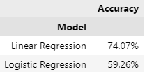

## Contents
- [Introduction](#introduction)
    - [Addressing the Elephant in the Room](#addressing-the-elephant-in-the-room)

## Introduction
The prediction of stock price movements remains a central challenge and a point of fascination in various disciplines, from finance and economics to machine learning. Complex methodologies, including deep learning and sophisticated time-series analyses, have advanced the field, often dominating the conversation. However, in the midst of this complexity, there is still a strong case for revisiting simpler models.

In this study, we turn our attention to linear and logistic regression models to predict the directional movement of Apple Inc.'s stock price. Though these models may seem almost rudimentary compared to the multifaceted techniques now available, they offer valuable insights. Simplicity can provide clarity, interpretability, and a connection to foundational principles that might be lost in more intricate approaches.

The goal here is not to overshadow the advanced models but to understand the basic ones, recognize their limitations, and appreciate their role in the broader context of predictive analytics. By focusing on linear and logistic regressions, this exploration serves as a reminder that sometimes, the most profound insights can be derived from the basics. It's an academic endeavor that reinforces the importance of foundational learning and the continuous pursuit of understanding, even in a field that is ever-evolving and increasingly complex.

### Addressing the Elephant in the Room

In financial time series data, autocorrelation can complicate modeling and forecasting. This statistical property, where a stock's price today might be closely related to its price in recent days or weeks, undermines the assumption that observations are independent. To address this challenge, our analysis will utilize a shorter timeframe for both training and testing. By limiting the period of analysis and employing logarithmic returns, we aim to diminish the effect of autocorrelation, thus creating a more reliable model. This decision enables a focus on more immediate relationships in the data, without the potential distortion caused by lingering long-term dependencies.

### Linear and Logistic Regression in Brief
#### Linear Regression
Linear regression typically outputs continuous values. However, for our specific purpose of predicting the directional movement of stock prices (up or down), we need to convert these continuous predictions into binary form. We do this by applying a sign function to the continuous predictions. A positive prediction is translated into +1, representing an upward movement, while a negative prediction is translated into -1, representing a downward movement. This conversion allows us to compare the performance of the linear regression model directly with the logistic regression model, which inherently predicts binary outcomes. Linear regression can be generalized as such:

$$y=\beta{X} + \alpha$$

where $y$ is the predicted value, $\beta$ is the coefficient for the independent variable, and $\alpha$ is the y-intercept.

#### Logistic Regression
Logistic regression is designed to predict binary outcomes and outputs probabilities. In the context of our study, it is used to predict whether the stock price will move up or down. The model classifies the probabilities into two classes, typically using 0.5 as a threshold. A probability greater than 0.5 translates into a prediction of upward movement, while a probability less than or equal to 0.5 translates into a prediction of downward movement. Logistic regression can be generalized as such:

$$p(y=1) = \frac{1}{1 + e^{-(\beta{X} + \alpha)}}$$

where $p(y=1)$ is the probability of that the dependent variable $y$ is 1 (e.g. the stock price goes up), $\beta$ is the coefficient for the independent variable $X$, $\alpha$ is the bias term, and $e$ is the base of the natural logarithm.

## Methodology

The methodology of this exploration is broken down as follows:

1. **Retrieve Price Data for Apple Inc.**: Retrieve historical closing prices of Apple Inc. and selected market indices (e.g., VTI, DBC, ^VIX, AGG) from January 1<sup>st</sup>, 2022 to August 14<sup>th</sup>, 2023.

2. **Preprocess Data**: Calculate the logarithmic daily returns of the price data to reduce the autocorrelation effect and create a more robust model.

3. **Feature Selection**: The four market indices are chosen as proxies for the stock market (VTI), the commodities market (DBC), the bond market (AGG), and expected volatility (^VIX)

4. **Split Data into Training and Testing Sets**: Divide the data into training and testing sets using a time-series split to maintain chronological order. A shorter timeframe is chosen for the analysis to ensure that the model is not confounded by long-term dependencies.

5. **Train Linear and Logistic Regression Models**:
    - **Linear Regression**: Fit a linear regression model using the training data, predicting the continuous log returns. Note here that the predictions—not the input—are converted into binary values based on the signage of the predictions (-1 for negative return predictions and +1 for positive return predictions)
    - **Logistic Regression**: Fit a logistic regression model using the training data, predicting the binary directional movement (up/down).

6. **Make Predictions**: Use the trained models to predict the stock price movement on the testing set.

7. **Evaluate Model Accuracy**: Assess the models' accuracy by comparing the predicted directional movement with the actual movement.

8. **Backtesting**: Create a backtesting framework to simulate trading based on the models' predictions. This includes logging transactions and calculating profits for different strategies.

9. **Tune Logistic Regression Model**: Utilize techniques like Grid Search to find the optimal hyperparameters for the logistic regression model, retrain the model, and assess its performance.

10. **Repeat Backtest with Tuned Logistic Regression Model**: Repeat the backtesting procedure using the signals generated by the tuned logistic regression model and compare results.

## Implementation

### Price Retrieval and Data Preprocessing

Prices for AAPL, VTI, DBC, AGG, and ^VIX were retrieved using the `yfinance` library and can be accessed [here](data/AAPL-VTI-DBC-VIX-AGG-prices-20220101-20230814.csv).

```python
import pandas as pd
import numpy as np
from sklearn.model_selection import train_test_split
from sklearn.linear_model import LinearRegression, LogisticRegression

# Defining start and end dates.
start = '2022-01-01'
end = '2023-08-14'

# Reading in the prices
prices = pd.read_csv('data/AAPL-VTI-DBC-VIX-AGG-prices-20220101-20230814.csv', index_col=0, parse_dates=True)
data = np.log(prices).diff()[1:]
data.head()
```


### Feature Selection and Train-Test Split

```python
# Setting the X and y variables.
X = data[indices]
y_linear = data[stock].squeeze() # Continuous values for linear regression predictions.
y_logistic = np.sign(y_linear) # Binary values for logistic regression predictions

# Dividing the processed data into training and testing sets for linear and logistic regression models, ensuring chronological order.
X_train, X_test, y_train_linear, y_test_linear = train_test_split(X, y_linear, shuffle=False, test_size=.2, random_state=42)
_, _, y_train_logistic, y_test_logistic = train_test_split(X, y_logistic, shuffle=False, test_size=.2, random_state=42)
```

### Model Training

```python
from sklearn.linear_model import LinearRegression, LogisticRegression

linear_regression = LinearRegression()
logistic_regression = LogisticRegression(random_state=42) # Set random state for reproducability.

linear_regression.fit(X_train, y_train_linear)
logistic_regression.fit(X_train, y_train_logistic);
```

### Predicting Movement and Assessing Accuracy of Predictions

```python
from sklearn.metrics import accuracy_score

y_pred_lin = np.sign(linear_regression.predict(X_test))
y_pred_log = logistic_regression.predict(X_test)

accuracy_lin = accuracy_score(np.sign(y_test_linear), y_pred_lin) # Convert predictions into binary values
accuracy_log = accuracy_score(y_test_logistic, y_pred_log)
```
