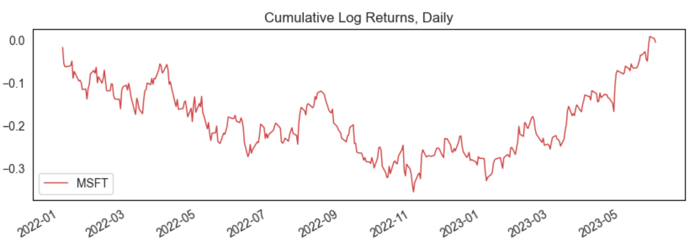
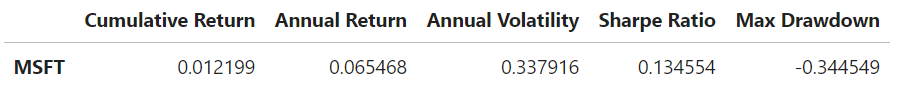

# The Convergence of Models
### Continuous and Binary Predictions in Stock Trading

Aung Si 
August 30th, 2023

---

## Contents
- [Introduction](#introduction)
- [Methodology](#methodology)
    - [A Note on Methodological Nuances](#a-note-on-methodological-nuances)
    - [Breakdown](#breakdown)
- [The Data](#the-data)
- [Minimizing False Positives: Precision](#minimizing-false-positives-precision)
- [Assessing MSFT](#assessing-msft)

---

## Introduction
Navigating the labyrinthine world of stock prediction is often fraught with erratic outcomes and sparse consistency. The prevailing wisdom, backed by a plethora of academic scrutiny, suggests that achieving reliable returns through predictive models remains elusive. This study sidesteps the traditional approach of stock price forecasting, opting instead to focus on daily stock returns—specifically for Microsoft (MSFT) from January 2022 to June 2023. We deploy linear and logistic regression models, scrutinizing their efficacy through metrics like RMSE and precision. Our aim is not to unearth a foolproof strategy for colossal gains but to explore the nuances in model selection and tuning, particularly under the constraints of real-world trading scenarios.

## Methodology

### A Note On Methodological Nuances
This study deliberately diverges from the standard practice of regressing stock values, opting instead to forecast directional stock return movement, denoted as -1 and 1 for downward and upward trends respectively. This pivot carries significant ramifications for both real-world utility and evaluative metrics. In the real trading environment, precise directional movement prediction often holds more actionable value than exact future stock prices. This aligns particularly well with long-only trading strategies, where the focus is on identifying stocks poised for upward movement.

Evaluation metrics undergo a dual-phase transition. Initially, RMSE serves as the yardstick for selecting the optimal linear regressor, ensuring the chosen model minimizes the square errors of continuous return predictions. However, the model's output is then binarized to fit into a classification schema, at which point the evaluative spotlight shifts to precision. This metric is paramount in a long-only strategy, as it adeptly quantifies the model's ability to minimize false positives, a crucial factor in maximizing profitability. By employing RMSE in the initial phase and pivoting to precision for final assessment, the study harmonizes the evaluation process, making it possible to compare 'apples to apples' when transitioning from regression to classification models.

### Breakdown

1. **Data Preparation**
    - The inputs—Open, High, Low, Volume, and Inflation—are transformed into percentage changes to improve linearity, followed by standard scaling for model optimization. These are used to predict our target, which is the signage of the daily returns of Microsoft (MSFT).  

2. **Determining the Best Regressor** (each evaluated on RMSE)
    - **Linear Regression**: Serves as the baseline.
    - **Decision Tree Regression**: A non-linear model.
    - **Tuning Decision Tree**: Hyperparameter-optimized using `GridSearchCV`.
    - **Random Forest Regression**: An ensemble approach.
    - **Tuning Random Forest**: Further refined through hyperparameter tuning.
    - **Classification Conversion**: The best-performing regressor's output is binarized to indicate directionality, making precision and accuracy the pivotal metrics for this phase.  

3. **Logistic Regression Modeling**
    - Directly predicts binary outcomes, with performance gauged through precision.
    - **Hyperparameter Tuning**: Grid search optimizes the logistic model, focusing on improving precision.  

4. **Real-world Validation**
    - Both models undergo back-testing in a long-only trading strategy, providing a real-world performance benchmark.

## The Data

The dataset scrutinized comprises daily trading variables for MSFT, spanning from January 1, 2022, to June 1, 2023.* We focus on salient trading indicators like volume, open, high, and low prices, augmented by the inflation rate as an external macroeconomic variable. These attributes are converted to percentage changes, a transformation aimed at enhancing their linearity and thereby optimizing their compatibility with linear models. Post-transformation, the features undergo standard scaling to normalize their ranges and boost model performance. This forms the bedrock for the ensuing model selection and performance evaluations.

**The data is retrieved using `yfinance` and can be found [here](data/MSFT-20220101-20230601.csv).*

## Minimizing False Positives: Precision

In a long-only trading strategy, where the objective is to capitalize on upward market movements, the cost of false positives—incorrectly predicting a stock will rise when it actually declines—can be substantial. Precision emerges as a vital performance metric in this context. It quantifies the model's ability to correctly identify true positives while minimizing false positives, thus serving as a gauge of the model's reliability in maximizing profitability.

By focusing on precision as the evaluative metric, the study aligns the model assessment process with the real-world trading objectives. This is particularly crucial when the model's recommendations directly influence trading decisions, where a high rate of false positives can erode the investment capital rapidly. In sum, the choice of precision as the primary metric offers a targeted approach to model evaluation, one that is particularly aligned with the risk and reward profile of a long-only trading strategy.

## Assessing MSFT

In assessing Microsoft's (MSFT) financial performance, key metrics reveal a nuanced picture:

The cumulative return of 0.012199 indicates modest capital appreciation, while an annual return of 0.065468 offers moderate, yet consistent gains. However, these rewards come at the cost of elevated risk, as reflected in the annual volatility of 0.337916 and a maximum drawdown of -0.344549. The Sharpe ratio of 0.134554 further underscores that these returns are attained by shouldering a considerable amount of risk. It's noteworthy that these statistics come on the heels of a turbulent 2022, marked by record-high inflation rates that led to a broad stock market downturn. While tech stocks, including MSFT, have generally shown signs of recovery this year, the outlook remains uncertain. Given this backdrop, MSFT appears to be an investment suited for those with higher risk tolerance, seeking moderate returns in a market still finding its footing post-crash.
