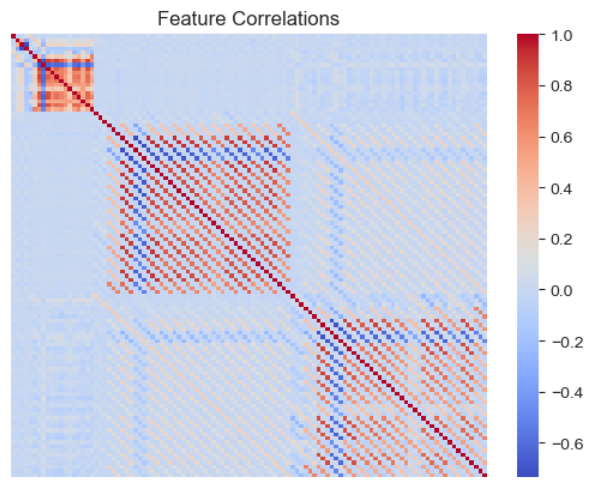

# Dynamic Portfolio Optimization with Sector Rotation & Machine Learning
Aung Si 
September 9th, 2023

---

## Abstract
In this project, I've engineered an adaptive machine learning algorithm that undergoes biannual recalibration to select the most accurate model for sector-based investment strategies. To counteract the pitfalls of over-forecasting, the algorithm employs a custom loss function that penalizes overpredictions. It comprehensively integrates a diverse range of financial indicators, including equity, debt, commodities, and market volatility. To enhance computational efficiency and model precision, I employed Principal Component Analysis for feature reduction. The model's robustness was substantiated through a 15-year backtest, during which it outperformed the SPY index by an estimated 91.85%. The finalized, vetted model has been encapsulated in a real-time dashboard, effectively translating intricate analytics into actionable market insights.

## Introduction
Financial markets are inherently volatile and self-correcting, subject to externalities including but not limited to equities, debt instruments, commodities, and market sentiment. Traditional investment models often falter in this ever-changing landscape, and even adaptable strategies like sector rotation are usually limited by heuristic-based decision-making.

In this project, I've constructed a machine learning framework that operates as a "model of models." Rather than being a singular static model, it encompasses multiple machine learning algorithms. Every six months, each constituent model is retrained and assessed for performance. The best-performing model is then selected for the ensuing period, thereby ensuring that the framework remains attuned to the current market conditions.

To fortify the framework against the common pitfall of over-forecasting, I've implemented a custom loss function. This function penalizes overpredictions, thereby enhancing the framework's reliability. I've also integrated a wide array of financial indicators to achieve a comprehensive market analysis. For computational efficacy and precision, Principal Component Analysis (PCA) has been employed for feature selection and dimensionality reduction.

To substantiate the framework's efficacy, a 15-year backtest was conducted, during which it consistently outperformed the SPY index. The insights derived from this framework have been operationalized through a real-time dashboard, making the analytics readily actionable.

## Data

The initial data pool encompassed daily prices of all 503 constituents of the S&P 500 (the tickers for which were scraped from [Wikipedia](https://en.wikipedia.org/wiki/List_of_S%26P_500_companies)), along with four pivotal market indices: TI, DBC, AGG, and VIX used as proxies for the prices of stocks, commodities, bonds, and volatility. All prices were fetched using the [`yfinance`](https://pypi.org/project/yfinance/) package. However, data gaps necessitated a refinement of this dataset and the analytical timeframe. Post-cleaning, the effective timeframe spanned from November 17, 2006, to September 11, 2023.

Further adjustment involved feature shifting to accommodate a 252-day forecast, equivalent to the number of trading days in a year. Consequently, the dataset's starting point for the model training was shifted to November 20, 2007. This maneuver ensured that the model's predictive variables align accurately with the forecast period, while still maintaining data integrity. This dataset provides a robust 16-year snapshot of market behavior, forming the bedrock for the machine learning framework.

## Feature & Target Engineering

### Features
The feature set is crafted to encapsulate diverse market indicators and sectoral insights. The following breaks the engineering process down:

#### Data Sources
- **S&P 500 Constituents**: 419 stocks with historical prices from February 6, 2006, to the present.
- **Market Indices**: Four key indices—Bonds, Commodities, Stocks, and Volatility—also spanning the same timeframe.
#### Feature Transformation and Enhancement
- **Log Returns**: Log returns were computed from prices to ensure stationarity of features.
- **Lookback Period**: A 10-day rolling window was used to calculate the Sharpe ratio for each feature, annualized with a factor of 252.
- **Lagged Features**: Created for each quarter (63 trading days) up to a year, capturing seasonality and longer-term trends.
#### Statistical Tests
- **ADF Test**: Augmented Dickey-Fuller test confirmed all features to be stationary, a prerequisite for time-series modeling.
#### Dimensionality
The final dataset comprises 120 features, tested for stationarity. Initially, a heatmap of feature correlations revealed significant concerns regarding multicollinearity:

    

However, this issue was mitigated using Principal Component Analysis (PCA) within the modeling pipelines, details of which will be elaborated upon in the subsequent sections.

The feature set aims to capture the snapshot of current market conditions and includes backward-looking indicators that help the machine learning models understand historical market behavior. Rolling computations were employed to preclude any data leakage from future observations, thereby maintaining the integrity of the predictive models.

### Targets
#### Sectoral Returns as Targets
The primary targets for this machine learning framework are the sectoral returns, which are calculated as the average log returns of the stocks within each GICS (Global Industry Classification Standard) Sector. These sectoral returns serve as the key performance indicators that the models aim to predict, thereby enabling a sector rotation strategy.

#### Calculation
- **Sector Identification**: Stocks are first categorized into their respective GICS Sectors.
- **Log Returns**: Following identification, stock prices are transformed into log returns.
- **Average Log Returns**: For each trading day, the average log returns of the stocks in each sector are computed to generate the sectoral returns.

#### Rationale
Sectoral returns offer an aggregated, yet nuanced, view of market trends. By focusing on sectoral returns as targets, the models can capture underlying economic factors affecting specific industries. This facilitates a more informed and targeted investment strategy, compared to using broader market indices and enables a strategy that can adapt to sector-specific trends and conditions.
